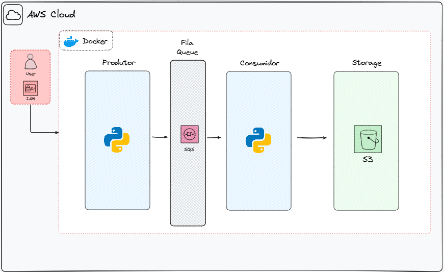

# Pipeline AWS SQS para S3

[](https://python.org)
[](https://aws.amazon.com)
[](https://docker.com)
[](https://python-poetry.org)

> 📖 **Documentação**: [Português](#pipeline-aws-sqs-para-s3) | [English](#aws-sqs-to-s3-pipeline-english)

Um pipeline que demonstra práticas modernas de engenharia de dados usando serviços AWS. Este projeto gera dados sintéticos de usuários, processa-os através de filas Amazon SQS e armazena os resultados em buckets Amazon S3.

## Visão Geral da Arquitetura

```
[Gerador de Dados] → [Amazon SQS] → [Consumidor/Processador] → [Amazon S3]
```




1. **Geração de Dados**: Cria dados sintéticos de usuários usando a biblioteca Faker
2. **Fila de Mensagens**: Envia dados para AWS SQS para processamento confiável de mensagens
3. **Processamento do Consumidor**: Recupera mensagens, transforma dados para formato JSON
4. **Armazenamento**: Faz upload de arquivos processados para AWS S3 com limpeza automática

## 📋 Pré-requisitos

### Requisitos AWS
- Conta AWS com permissões apropriadas
- Usuário IAM com permissões de acesso ao SQS e S3
- AWS Access Key ID e Secret Access Key

### Desenvolvimento Local
- Python 3.12+
- Poetry (para gerenciamento de dependências)
- Docker (opcional, para execução containerizada)

## ⚙️ Instalação

### Configuração

Altere o nome do arquivo `.env-example` para `.env` e insira suas credenciais AWS

```env
AWS_ACCESS_KEY_ID=<seu_aws_access_key_id_aqui>
AWS_SECRET_KEY=<sua_aws_secret_key_aqui>
REGION_NAME=<sua_aws_region_name_aqui>
```

### Opção 1: Configuração Local com Poetry

1. **Clone o repositório**
   ```bash
   git clone git@github.com:vgrcontreras/aws-sqs-to-s3-etl.git
   cd aws-sqs-to-s3-etl
   ```

2. **Instale as dependências**
   ```bash
   pip install poetry
   poetry install
   ```

3. **Execute a aplicação**
   ```bash
   poetry run python -m src.main
   ```

### Opção 2: Configuração com Docker

1. **Construa a imagem Docker**
   ```bash
   docker build -t aws-sqs-to-s3-etl .
   ```

2. **Execute com arquivo de ambiente**
   ```bash
   docker run --env-file .env aws-sqs-to-s3-etl
   ```

## 📁 Estrutura do Projeto

```
aws-sqs-to-s3-etl/
├── src/
│   ├── main.py              # Ponto de entrada principal da aplicação
│   ├── producer.py          # Produtor de mensagens SQS
│   ├── consumer.py          # Consumidor de mensagens SQS e uploader S3
│   ├── generate_users.py    # Geração de dados sintéticos
│   ├── create_queue.py      # Criação de fila SQS
│   └── create_s3_bucket.py  # Criação de bucket S3
├── utils/
│   ├── aws_client.py        # Configuração do cliente AWS
│   └── settings.py          # Configurações de ambiente
├── Dockerfile               # Configuração do container
├── pyproject.toml          # Dependências Poetry
└── README.md               # Documentação do projeto
```

## 🔍 Monitoramento e Logging

A aplicação usa Loguru para logging abrangente:

- **Nível Info**: Operações bem-sucedidas, criação de filas, uploads de arquivos
- **Nível Error**: Erros de serviços AWS, falhas em operações de arquivos
- **Nível Debug**: Informações detalhadas de processamento

Exemplo de saída de log:
```
2024-01-15 10:30:15 | INFO | Fila criada com sucesso. QueueUrl: https://sqs.us-east-1.amazonaws.com/123456789012/aws-sqs-to-s3-etl-queue
2024-01-15 10:30:16 | INFO | Mensagem enviada para a fila com sucesso.
2024-01-15 10:30:17 | INFO | users_20240115_103017.json enviado para aws-sqs-to-s3-etl-bucket com sucesso
```

---

# AWS SQS to S3 Pipeline (English)

> 📖 **Documentation**: [Português](#pipeline-aws-sqs-para-s3) | [English](#aws-sqs-to-s3-pipeline-english)

A pipeline that demonstrates modern data engineering practices using AWS services. This project generates synthetic user data, processes it through Amazon SQS queues, and stores the results in Amazon S3 buckets.

## Architecture Overview

```
[Data Generator] → [Amazon SQS] → [Consumer/Processor] → [Amazon S3]
```


1. **Data Generation**: Creates synthetic user data using Faker library
2. **Message Queue**: Sends data to AWS SQS for reliable message processing
3. **Consumer Processing**: Retrieves messages, transforms data to JSON format
4. **Storage**: Uploads processed files to AWS S3 with automatic cleanup

## 📋 Prerequisites

### AWS Requirements
- AWS Account with appropriate permissions
- IAM user with SQS and S3 access permissions
- AWS Access Key ID and Secret Access Key

### Local Development
- Python 3.12+
- Poetry (for dependency management)
- Docker (optional, for containerized execution)

## ⚙️ Installation

### Configuration

Change `.env-example` file name to `.env` and insert your AWS credentials

```env
AWS_ACCESS_KEY_ID=<your_aws_access_key_id_here>
AWS_SECRET_KEY=<your_aws_secret_key_here>
REGION_NAME=<your_aws_region_name_here>
```

### Option 1: Local Setup with Poetry

1. **Clone the repository**
   ```bash
   git clone git@github.com:vgrcontreras/aws-sqs-to-s3-etl.git
   cd aws-sqs-to-s3-etl
   ```

2. **Install dependencies**
   ```bash
   pip install poetry
   poetry install
   ```

3. **Run the application**
   ```bash
   poetry run python -m src.main
   ```

### Option 2: Docker Setup

1. **Build the Docker image**
   ```bash
   docker build -t aws-sqs-to-s3-etl .
   ```

2. **Run with environment file**
   ```bash
   docker run --env-file .env aws-sqs-to-s3-etl
   ```

## 📁 Project Structure

```
aws-sqs-to-s3-etl/
├── src/
│   ├── main.py              # Main application entry point
│   ├── producer.py          # SQS message producer
│   ├── consumer.py          # SQS message consumer and S3 uploader
│   ├── generate_users.py    # Synthetic data generation
│   ├── create_queue.py      # SQS queue creation
│   └── create_s3_bucket.py  # S3 bucket creation
├── utils/
│   ├── aws_client.py        # AWS client configuration
│   └── settings.py          # Environment settings
├── Dockerfile               # Container configuration
├── pyproject.toml          # Poetry dependencies
└── README.md               # Project documentation
```

## 🔍 Monitoring and Logging

The application uses Loguru for comprehensive logging:

- **Info Level**: Successful operations, queue creation, file uploads
- **Error Level**: AWS service errors, file operation failures
- **Debug Level**: Detailed processing information

Example log output:
```
2024-01-15 10:30:15 | INFO | Queue create successfully. QueueUrl: https://sqs.us-east-1.amazonaws.com/123456789012/aws-sqs-to-s3-etl-queue
2024-01-15 10:30:16 | INFO | Message send to queue successfully.
2024-01-15 10:30:17 | INFO | users_20240115_103017.json uploaded to aws-sqs-to-s3-etl-bucket successfully
```

